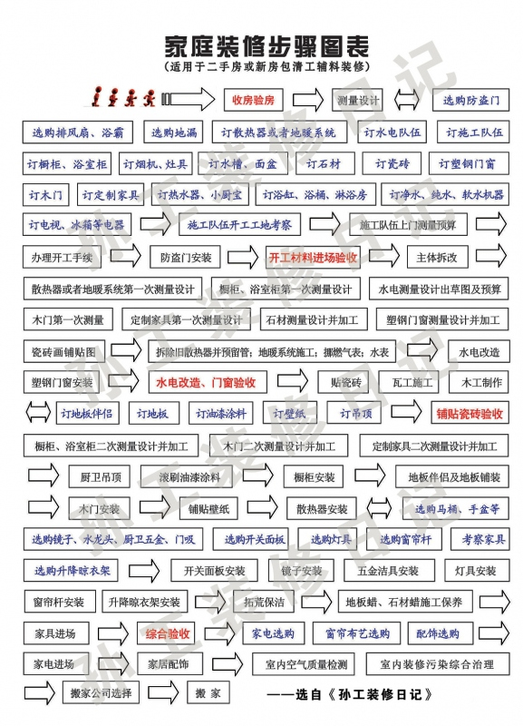

为了统筹安排装修，我需要得到清晰的装修脉络和步骤指导，于是我查阅了大量的装修书籍和装修日记，想找一个实用的装修步骤图表，结果让我很失望。虽然很多人都提到了装修步骤，但不是不全，就是脉络混乱，而且大部分是指导纲领性步骤，不具备实用价值。没办法，自己动手丰衣足食吧！于是我在综合各家之长并结合自己的调查总结后吐血绘制了这份“家庭装修步骤图表（是“设计”+“工序流程图”的结合）”。
这份“家庭装修步骤图表”足足用了我将近一周的时间，其辛苦和劳累我就不用言语描述了。我敢保证，这是目前国内最翔实明确的装修步骤图表（特指二手房或新房包清工辅料装修），有兴趣的朋友可以下载打印，按步骤施工进行。当然，这里肯定也有不足甚至错误的地方，望行家指正修改，不胜感谢。

## **几点简单说明：**
### **1、关于字体和颜色的含义**

0. 黑色宋体字代表装修步骤
0. 蓝色楷体字代表选择或采购步骤
0. 红色黑体字代表验收或结算步骤
0. 单向箭斗代表下一步
0. 双向箭头代表可同步进行
### **2、不建议赶工期**
每步骤之间或有重合或交叉，需根据实际情况灵活掌握，我不建议赶工期。装修是大事，没必要为赶那几天而闹心好几年。
### **3、花钱要慎重**
花钱也是大事，要慎重。采购方面基本可以按我图表中的四大步进行，没必要一次性采购齐全。因为装修是在进行中不断思考、考察、判断、借鉴、修改的，有很多想法和主意会不断涌现，因此你不可能一次性把所有采购清单都想好并采购齐全还没遗憾。何况人的精力都是有限的，什么时候就该集中精力考察什么产品，不要分散精力。
### **4、关于“定金”与“订金”**
注意我表格中的“订”的意思是“选择后初步确定该产品”。如果当时没有特殊优惠就先记下联系方式和型号，作为储备，也方便日后咨询；如果感觉优惠幅度比较令自己满意，就先下订金，并也记下联系方式和型号，方便在详细研究该家产品的时候随时咨询。在感觉优惠幅度都不错的情况下可以同类产品订几家，先占好优惠条件，然后再细心筛选。

但切记，下的一定要是“订”金，而不是“定”金！因为“订”金可退，而“定”金不可退。同时要问好退“订”金的条件和地点，防止到时候被刁难。

我表格中所有带“订”字的都建议只是初步考察，没必要签合同购买，因为在接下来的步骤里你会更深入地体会到你到底需要什么产品，该产品到底适合不适合你。

另外，有很多产品只需要了解你中意产品的型号、尺寸规格、安装要点，并记下联系方式，连“订金”都不要付。因为很多产品只是你在装修中需要预留适合的位置和相关配套设施而已，而且这类产品的尺寸基本是相同或接近的，只要尺寸对了、配套设施有了，将来买谁家的都可以，装修完毕后想怎么挑选怎么购买都可以，没必要先花钱，尤其是对于装修资金不充足的朋友。

这些产品包括：电热水器、小厨宝、净水机、纯水机、软水机、电视、冰箱等电器，还有浴缸、浴桶、淋浴房及成品家具等。
### **5、关于“选购”的含义**
注意我表格中的“选购”的意思：这是必须在这步购买的，否则影响下一步的施工。
### **6、关于“验收”**
注意红色字体所标明的“验收”阶段，这阶段一定要打点精神提高注意力，否则影响的就是以后是否住得安全和舒心了。

 
转载自：
[1]https://www.zhihu.com/question/36248682/answer/67430725
